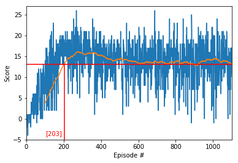

# Project report

## Learning algorithm

The employed learning algorithm is the standard Deep Q-Learning algorithm which was introduced in the article [Human-level control through deep reinforcement learning](https://storage.googleapis.com/deepmind-media/dqn/DQNNaturePaper.pdf). 

The underlying deep Q-Network is implemented in `networks.py` using `torch`. The results presented here are based on the following network architecture:

- Fully connected layer - input: 37 (state dimension) output: 64
- Fully connected layer - input: 64 output: 32
- Fully connected layer - input: 32 output: 16
- Fully connected layer - input: 16 output: 4 (action size)

 
The parameters used in the Deep Q-Learning algorithm are as follows:

- **gamma**:
    (RL discount factor for future rewards (see [Bellman's equation] https://en.wikipedia.org/wiki/Bellman_equation#A_dynamic_decision_problem)) 
- **learningRate**:
    The learning rate for the gradient descent while training the (local) neural network; 
    This parameter corresponds more or less to the parameter alpha in RL controlling the how much the most recent episodes contribute to the update of the Q-Table                            
- **dropProb**:
    Drop probability for the drop-out regularization.
- **dqnUpdatePace**:
    Determines after how many state-action steps the local network should  be updated. 
- **targetDqnUpdatePace**:
    If targetDqnUpdatePace < 1: a soft update is performed at each local network update
    If targetDqnUpdatePace >= 1: the target network is replaced by the local network
- **bufferSize**:
    Size of the memory buffer containing the experiences < s, a, r, s’ >
- **batchSize**:
    The batch size used in the gradient descent during learning
- **batchEpochs**:
    The number of epochs when training the network  

In `Navigation.ipynb` we try out different combinations of the parameters whereby following parameter values are held fixed:

- **gamma** = 0.99
- **learningRate** = 1e-4
- **dqnUpdatePace** = 5
- **bufferSize** = int(1e6)

## Results

The task is episodic, and in order to solve the environment, our agent must get an average score of +13 over 100 consecutive episodes.

For all parameter configurations we have trained the network for `1100` episodes even in the cases when the environment was solved for less than `1100` episodes we continued with training in order to observe further improvements. 

The _Epsilon_ parameter governing the policy is varied during training starting with `epsStart = 1` with a decay of `epsDecay=0.97` after each episode to a minimum value of `epsEnd=0.01` which is reached after `151` episodes.

# Soft Update of the Target Network

First we try out a _soft_ update of the target network with a parameter _Tau_ equal to `targetDqnUpdatePace = 5e-4`: 

    TARGET <--- (1-Tau) * TARGET + Tau * LOCAL
    
The training results are displayed in the following plot:

  

One can see that the environment is solved after 939 episodes and the average score remains above `13` when training continues. 

# Hard Update of the Target Network

Instead of a _soft_ update, let us consider a _hard_ update of the target network after `targetDqnUpdatePace = 299` steps which corresponds to the length of a single episode. 
   
I.e. the target network is not updated smoothly after each update of the local network, but is completely overwritten every `299` steps.

The training results are displayed in the following plot:

  

Now the environment is solved in 523 episodes which is a noticeable improvement compared to the soft update. It is interesting to observe that the averaged score continues to rise until about 550 training episodes when the average score reaches a value of about 16. Afterwards there is a drop and after the 600-th training episode it rises again and stabilizes at a value oscillating around 15.  

# Hard Update of the Target Network with Increased Number of Epochs

Until now the local network was updated every `dqnUpdatePace = 5` steps using a batch gradient descent (batch size of `batchSize = 64`) with a single _gradient step_ (single epoch). 

Let us now use a batch gradient descent of the same batch size but instead of making a single _gradient step_ each time the network is updated we will make `batchEpochs = 5` steps. I.e. we will run each time the gradient descent for five epochs.

The training results are displayed in the following plot:

  

With the new configuration the environment is solved after 274 episodes, once again a significant improvement. Here we also observe an oscillation in the average score after it reaches a value of about 16 followed by a stabilization around 15.

# Hard Update of the Target Network with Increased Number of Epochs and Drop-Out Regularization

To deal with potential overfitting (enhanced by the higher number of epochs) we introduce drop-out regularization with  a drop-out probability of `dropProb = 0.1`.

The training results are displayed in the following plot:

  

Now the environment is solved in only in 184 episodes. However the oscillation during the afterwards training which were observed in the previous cases is much greater and the performance drops even below the benchmark of 13.

The weights of the trained network with this parameter configuration at the peak of its maximum mean score are saved in `checkpoint.pth`.

## Possible Future Extensions of the Setting

1. It is clear that the parameters play a crucial role and one can always try to optimize these further.

A bunch of improvements on the bare Deep Q-Learning have been suggested in the literature:

2. Double DQNs: This method is also known as double Learning and was introduced in the article [Double Q-learning](https://papers.nips.cc/paper/3964-double-q-learning). Using this method, overestimation of Q-values can be tackled.

3. Prioritized Experience Replay (PER): This method was introduced in the article [Prioritized Experience Replay](https://arxiv.org/abs/1511.05952). This work is motivated by the idea to give priority to experiences which could be more important for completing the task.

4. Dueling Deep Q Networks (DDQNs): Dueling DQNs were introduced in the article [Dueling Network Architectures for Deep Reinforcement Learning](https://arxiv.org/abs/1511.06581). The architecture proposed in this work allows to decompose Q(s,a) into a sum of the state-value function V(s) and the advantage A(s,a) which quantifies the improvement of taking a particular action compared to all other ones at the given state. By calculating V(s), the agent learns about the value of a state without having to learn about the impact of each available action at that state. This is useful when the effect of available actions of states onto the environment is not too important.

5.  More extensions can be included, such as Learning from multi-step bootstrap targets, Distributional DQN and Noisy DQN. The combined impact of these six extensions was analyzed in the article [Rainbow: Combining Improvements in Deep Reinforcement Learning](https://arxiv.org/abs/1710.02298).

6. An additional challenge would be to learn from pixels. In such a project the state is given by an 84 x 84 RGB image and the neural network correponds to one of convolutional type. Training should be done using a GPU which is optimized to process image data.
